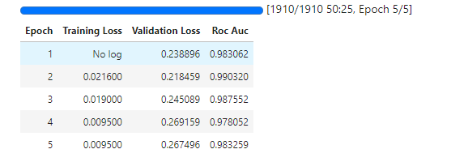

# Профильное задание на вакансию ML-инженер на стажировку ВК
Необходимо было решить задачу классификации текста на спам/неспам, опробовав разные подходы и выбрав лучший.

## Какие подходы протестировал
Я протестировал следующие подходы для классификации:
- `TF-IDF` векторизация с `RandomForest`. Векторизовал текст, а затем на этих фичах обучил случайный лес
- `CatBoost` и `Text Features`. CatBoost имеет параметр при обучении - `text_features`, где указывается название колонки с текстовой фичей.
Я решил попробовать посмотреть, как это сработает, предварительно добавив ещё одну фичу - длина текста (количество отдельных символов через пробел)
- `BERT`. Сделал файнтюнинг `BERTа` на наших текстовых данных. Обучал в течение 5ти эпох с размером батча 16, остальные параметры по умолчанию

В табличке представлены реузультаты работы с оценкой по метрике ROC-AUC 
Метод | ROC-AUC |
--- | --- |  
TF-IDF + RandomForest | 0.94793 | 
CatBoost + Text Features | 0.97485  |
BERT |  0.98357  |

## Результат
Как видно, `BERT` отработал лучше всего при тестировании. Поэтому для финального резульатата я использовал его. 
Результат находится в файле `submit.csv`
Весь код с разными методами и окончательным предскзаанием находится в `text_classification.ipynb`

> [!IMPORTANT]  
> Файнтюнинг `BERTа` пришлось делать на Kaggle, потому что локально не хватало мощностей. Весь код для обучения идентичен тому, что в ноутбеке
> 
> 
> 
> Приложу также ссылку на [веса](https://drive.google.com/drive/folders/1aXReYuEV5bobaTWMSHcyPqQk9273nrzs?usp=sharing) зафайнтюненого `BERTa`, чтобы можно было выполнить команду:
> ```
> model = AutoModelForSequenceClassification.from_pretrained('bert_model',num_labels=2)
> ```
